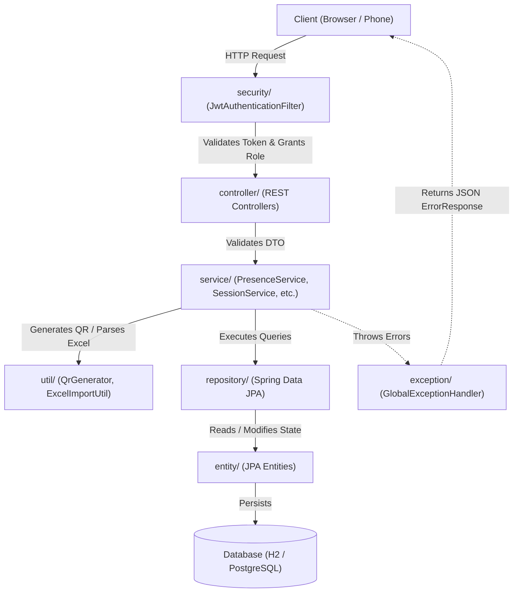

# QR Attendance — Backend Architecture & Module Interworking Guide

This document provides a comprehensive, folder-by-folder breakdown of the `qr-attendance` backend (`src/main/java/com/qrattend`), detailing the responsibilities of each layer and illustrating how all modules collaborate to deliver a secure, fraud-resistant classroom attendance platform.

---

## 1. High-Level Technology Stack

* **Language & Runtime:** Java 21 (LTS)
* **Framework:** Spring Boot 3.3.0
* **Build System:** Apache Maven (with `mvnw` wrapper)
* **Persistence & Database:**
  * File-based H2 Database for local development (`/data/attendance.mv.db`)
  * PostgreSQL compatible for production deployment (Supabase, Render)
  * Spring Data JPA / Hibernate ORM
* **Security & Tokens:** Spring Security with JSON Web Tokens (JJWT)
* **Libraries:**
  * **ZXing (Zebra Crossing):** QR code encoding and raster rendering
  * **Apache POI:** Excel `.xlsx` roster ingestion and parsing
  * **Project Lombok:** Elimination of boilerplate getters, setters, and constructors

---

## 2. Layered Architecture Blueprint

The backend strictly adheres to the standard **Spring Boot Layered Architecture**, separating concerns across dedicated packages:

```
backend/src/main/java/com/qrattend/
├── controller/   → Presentation / REST API Endpoints
├── service/      → Domain Business Logic, Presence & Anti-Cheat Algorithms
├── repository/   → Data Access Layer (Spring Data JPA)
├── entity/       → Relational Database Models (JPA Entities)
├── dto/          → Data Transfer Objects & Validation Rules
├── security/     → Spring Security Filters, Route Guards & Multi-Tier JWTs
├── exception/    → Custom Domain Exceptions & Global REST Advice
└── util/         → Standalone Utilities (ZXing QR & Apache POI)
```

---

## 3. Folder-by-Folder Breakdown

### 📁 `controller/` — REST API Gateway & Request Ingestion
* **Location:** [`backend/src/main/java/com/qrattend/controller`](file:///c:/Users/Harsha%20Karthikeya/Desktop/qr-attendance/backend/src/main/java/com/qrattend/controller)
* **Functionality:**
  * Acts as the external interface of the application, mapping incoming HTTP requests (`GET`, `POST`, `PUT`, `DELETE`) to handler methods.
  * Enforces parameter validation via Jakarta Validation annotations (`@Valid`).
  * Extracts the authenticated user's context (e.g., Professor ID or Session UUID) from the Spring Security principal.
  * Formats and returns standardized HTTP status codes (`200 OK`, `201 Created`, `400 Bad Request`, etc.) along with JSON payloads or raw binary streams.
* **Key Files:**
  * [`AuthController.java`](file:///c:/Users/Harsha%20Karthikeya/Desktop/qr-attendance/backend/src/main/java/com/qrattend/controller/AuthController.java): Exposes `/api/auth/register` and `/api/auth/login`.
  * [`AdminController.java`](file:///c:/Users/Harsha%20Karthikeya/Desktop/qr-attendance/backend/src/main/java/com/qrattend/controller/AdminController.java): Exposes `/api/admin/invite-code` guarded by an administrative secret.
  * [`CourseController.java`](file:///c:/Users/Harsha%20Karthikeya/Desktop/qr-attendance/backend/src/main/java/com/qrattend/controller/CourseController.java): Handles CRUD operations for courses owned by the logged-in professor.
  * [`StudentController.java`](file:///c:/Users/Harsha%20Karthikeya/Desktop/qr-attendance/backend/src/main/java/com/qrattend/controller/StudentController.java): Manual roster mutations and bulk Excel file upload (`/api/students/courses/{courseId}/import-excel`).
  * [`SessionController.java`](file:///c:/Users/Harsha%20Karthikeya/Desktop/qr-attendance/backend/src/main/java/com/qrattend/controller/SessionController.java): Controls session lifecycles, delivers live PNG QR codes (`/api/sessions/{id}/qr`), and supports manual overrides.
  * [`StudentScanController.java`](file:///c:/Users/Harsha%20Karthikeya/Desktop/qr-attendance/backend/src/main/java/com/qrattend/controller/StudentScanController.java): Handles student interactions: QR registration (`/api/student/scan`), real-time heartbeats (`/api/student/heartbeat`), and live doubts (`/api/student/doubt`).
  * [`ReportController.java`](file:///c:/Users/Harsha%20Karthikeya/Desktop/qr-attendance/backend/src/main/java/com/qrattend/controller/ReportController.java): Serves aggregate attendance rates, session breakdowns, and student histories.
  * [`HealthController.java`](file:///c:/Users/Harsha%20Karthikeya/Desktop/qr-attendance/backend/src/main/java/com/qrattend/controller/HealthController.java): Liveness probes for platforms like Render.

---

### 📁 `service/` — Business Logic & Verification Engine
* **Location:** [`backend/src/main/java/com/qrattend/service`](file:///c:/Users/Harsha%20Karthikeya/Desktop/qr-attendance/backend/src/main/java/com/qrattend/service)
* **Functionality:**
  * Contains the core domain rules, computations, state management, and transactional boundaries (`@Transactional`).
  * Isolates business decisions from HTTP transport concerns.
  * Implements real-time anti-cheat logic, cryptographic nonce generation, and scheduled background sweeps.
* **Key Files:**
  * [`PresenceService.java`](file:///c:/Users/Harsha%20Karthikeya/Desktop/qr-attendance/backend/src/main/java/com/qrattend/service/PresenceService.java): The anti-cheat core. Validates roll numbers against course rosters, maintains rotating nonce handshakes, logs heartbeats, checks for browser automation (`navigator.webdriver`), and runs a 1-minute cron job (`computeSessionCoverage`) requiring $\ge 80\%$ presence coverage to confirm attendance.
  * [`SessionService.java`](file:///c:/Users/Harsha%20Karthikeya/Desktop/qr-attendance/backend/src/main/java/com/qrattend/service/SessionService.java): Coordinates QR session lifecycles, dynamically constructs transient scan tokens, and delegates image rendering to `QrGenerator`.
  * [`AuthService.java`](file:///c:/Users/Harsha%20Karthikeya/Desktop/qr-attendance/backend/src/main/java/com/qrattend/service/AuthService.java): Encrypts passwords using BCrypt, authenticates credentials, and issues Professor JWTs.
  * [`CourseService.java`](file:///c:/Users/Harsha%20Karthikeya/Desktop/qr-attendance/backend/src/main/java/com/qrattend/service/CourseService.java): Guarantees multi-tenant data isolation so professors can only access their own courses.
  * [`StudentService.java`](file:///c:/Users/Harsha%20Karthikeya/Desktop/qr-attendance/backend/src/main/java/com/qrattend/service/StudentService.java): Coordinates student roster synchronization and Excel file parsing.
  * [`ReportService.java`](file:///c:/Users/Harsha%20Karthikeya/Desktop/qr-attendance/backend/src/main/java/com/qrattend/service/ReportService.java): Computes attendance percentages, absentee lists, and session summaries.
  * [`AdminService.java`](file:///c:/Users/Harsha%20Karthikeya/Desktop/qr-attendance/backend/src/main/java/com/qrattend/service/AdminService.java): Generates and tracks one-time invite codes.

---

### 📁 `repository/` — Data Access Layer (Spring Data JPA)
* **Location:** [`backend/src/main/java/com/qrattend/repository`](file:///c:/Users/Harsha%20Karthikeya/Desktop/qr-attendance/backend/src/main/java/com/qrattend/repository)
* **Functionality:**
  * Interfaces extending `JpaRepository` that abstract database queries.
  * Translates method names and JPQL into optimized SQL queries executed against H2 or PostgreSQL.
* **Key Files:**
  * [`ProfessorRepository.java`](file:///c:/Users/Harsha%20Karthikeya/Desktop/qr-attendance/backend/src/main/java/com/qrattend/repository/ProfessorRepository.java): Lookups by email and unique ID.
  * [`CourseRepository.java`](file:///c:/Users/Harsha%20Karthikeya/Desktop/qr-attendance/backend/src/main/java/com/qrattend/repository/CourseRepository.java): Queries courses assigned to a professor.
  * [`StudentRepository.java`](file:///c:/Users/Harsha%20Karthikeya/Desktop/qr-attendance/backend/src/main/java/com/qrattend/repository/StudentRepository.java): Queries students by course and roll number.
  * [`QrSessionRepository.java`](file:///c:/Users/Harsha%20Karthikeya/Desktop/qr-attendance/backend/src/main/java/com/qrattend/repository/QrSessionRepository.java): Queries active, closed, or expired sessions.
  * [`AttendanceRepository.java`](file:///c:/Users/Harsha%20Karthikeya/Desktop/qr-attendance/backend/src/main/java/com/qrattend/repository/AttendanceRepository.java): Retrieves attendance states (`PENDING`, `CONFIRMED`, `INVALIDATED`).
  * [`HeartbeatRepository.java`](file:///c:/Users/Harsha%20Karthikeya/Desktop/qr-attendance/backend/src/main/java/com/qrattend/repository/HeartbeatRepository.java): Inserts and aggregates timestamped client heartbeats.
  * [`DoubtRepository.java`](file:///c:/Users/Harsha%20Karthikeya/Desktop/qr-attendance/backend/src/main/java/com/qrattend/repository/DoubtRepository.java): Real-time anonymous doubts asked during active sessions.

---

### 📁 `entity/` — Database Domain Models (JPA / Hibernate)
* **Location:** [`backend/src/main/java/com/qrattend/entity`](file:///c:/Users/Harsha%20Karthikeya/Desktop/qr-attendance/backend/src/main/java/com/qrattend/entity)
* **Functionality:**
  * Represents tables in the relational database.
  * Uses JPA annotations (`@Entity`, `@Table`, `@ManyToOne`, `@OneToMany`, `@Enumerated`) to map object graphs to schema tables.
* **Key Files:**
  * [`Professor.java`](file:///c:/Users/Harsha%20Karthikeya/Desktop/qr-attendance/backend/src/main/java/com/qrattend/entity/Professor.java): Instructor entity (name, email, BCrypt password hash).
  * [`Course.java`](file:///c:/Users/Harsha%20Karthikeya/Desktop/qr-attendance/backend/src/main/java/com/qrattend/entity/Course.java): Course entity linked to a professor.
  * [`Student.java`](file:///c:/Users/Harsha%20Karthikeya/Desktop/qr-attendance/backend/src/main/java/com/qrattend/entity/Student.java): Student roster entity (rollNumber, name, course).
  * [`QrSession.java`](file:///c:/Users/Harsha%20Karthikeya/Desktop/qr-attendance/backend/src/main/java/com/qrattend/entity/QrSession.java): Attendance session window (`startTime`, `durationSeconds`, `expiresAt`, `status`).
  * [`Attendance.java`](file:///c:/Users/Harsha%20Karthikeya/Desktop/qr-attendance/backend/src/main/java/com/qrattend/entity/Attendance.java): Core record linking student to session, tracking verification state, coverage percentage, and rotating nonces.
  * [`AttendanceStatus.java`](file:///c:/Users/Harsha%20Karthikeya/Desktop/qr-attendance/backend/src/main/java/com/qrattend/entity/AttendanceStatus.java): State enum (`PENDING`, `CONFIRMED`, `INVALIDATED`, `MANUAL_OVERRIDE`).
  * [`Heartbeat.java`](file:///c:/Users/Harsha%20Karthikeya/Desktop/qr-attendance/backend/src/main/java/com/qrattend/entity/Heartbeat.java): Audit log entry for each 5s ping received from the student's browser.
  * [`Doubt.java`](file:///c:/Users/Harsha%20Karthikeya/Desktop/qr-attendance/backend/src/main/java/com/qrattend/entity/Doubt.java): Anonymous question submitted during an active lecture.

---

### 📁 `dto/` — Data Transfer Objects & Validation Rules
* **Location:** [`backend/src/main/java/com/qrattend/dto`](file:///c:/Users/Harsha%20Karthikeya/Desktop/qr-attendance/backend/src/main/java/com/qrattend/dto)
* **Functionality:**
  * Strict API contracts for inbound requests and outbound responses.
  * Prevents over-posting vulnerabilities and prevents direct exposure of database models.
  * Contains sub-packages organized by domain: `auth`, `admin`, `course`, `session`, `scan`, `student`.
* **Key Files:**
  * `auth/`: `LoginRequest`, `RegisterRequest`, `TokenResponse`.
  * `session/`: `SessionRequest`, `SessionResponse`, `OverrideRequest`, `ExtendRequest`.
  * `scan/`: `ScanRequest`, `ScanResponse`, `HeartbeatRequest`, `HeartbeatResponse`, `DoubtRequest`.
  * [`ErrorResponse.java`](file:///c:/Users/Harsha%20Karthikeya/Desktop/qr-attendance/backend/src/main/java/com/qrattend/dto/ErrorResponse.java): Standardized error format `{ status, error, message, timestamp }`.

---

### 📁 `security/` — Authentication, Authorization & JWTs
* **Location:** [`backend/src/main/java/com/qrattend/security`](file:///c:/Users/Harsha%20Karthikeya/Desktop/qr-attendance/backend/src/main/java/com/qrattend/security)
* **Functionality:**
  * Implements Spring Security filter chains, stateless session policies, CORS headers, and token lifecycle management.
  * Employs a **three-tier JWT strategy**:
    1. **Professor JWT:** Authenticates instructor dashboard actions (`ROLE_PROFESSOR`, valid for 24h).
    2. **Scan JWT:** Encoded into the rolling QR image; short-lived (`ROLE_SCAN`, valid for 15s).
    3. **Attendance JWT:** Issued to student after scanning; authorizes heartbeats and doubts (`ROLE_ATTENDANCE`, valid for 2h).
* **Key Files:**
  * [`SecurityConfig.java`](file:///c:/Users/Harsha%20Karthikeya/Desktop/qr-attendance/backend/src/main/java/com/qrattend/security/SecurityConfig.java): Configures `SecurityFilterChain`, CORS allowed origins, route permissions, and installs JWT filters.
  * [`JwtAuthenticationFilter.java`](file:///c:/Users/Harsha%20Karthikeya/Desktop/qr-attendance/backend/src/main/java/com/qrattend/security/JwtAuthenticationFilter.java): Extracts `Bearer <token>` from HTTP headers, validates signatures, and populates `SecurityContextHolder`.
  * [`JwtUtil.java`](file:///c:/Users/Harsha%20Karthikeya/Desktop/qr-attendance/backend/src/main/java/com/qrattend/security/JwtUtil.java): Low-level cryptographic token generation, parsing, and claim inspection.
  * [`JwtAuthenticationEntryPoint.java`](file:///c:/Users/Harsha%20Karthikeya/Desktop/qr-attendance/backend/src/main/java/com/qrattend/security/JwtAuthenticationEntryPoint.java): Traps 401 Unauthorized access and returns clean JSON error structures.

---

### 📁 `exception/` — Centralized Error Handling
* **Location:** [`backend/src/main/java/com/qrattend/exception`](file:///c:/Users/Harsha%20Karthikeya/Desktop/qr-attendance/backend/src/main/java/com/qrattend/exception)
* **Functionality:**
  * Centralizes application error handling using `@RestControllerAdvice`.
  * Translates internal domain exceptions into clean HTTP status codes and uniform JSON responses without leaking stack traces.
* **Key Files:**
  * [`GlobalExceptionHandler.java`](file:///c:/Users/Harsha%20Karthikeya/Desktop/qr-attendance/backend/src/main/java/com/qrattend/exception/GlobalExceptionHandler.java): Catches domain exceptions and validation failures.
  * Domain Exceptions:
    * [`AttendanceFraudException.java`](file:///c:/Users/Harsha%20Karthikeya/Desktop/qr-attendance/backend/src/main/java/com/qrattend/exception/AttendanceFraudException.java) $\rightarrow$ `400 Bad Request` (mismatched nonce, automation bot)
    * [`SessionClosedException.java`](file:///c:/Users/Harsha%20Karthikeya/Desktop/qr-attendance/backend/src/main/java/com/qrattend/exception/SessionClosedException.java) $\rightarrow$ `409 Conflict` (scan attempted after window expired)
    * [`ResourceNotFoundException.java`](file:///c:/Users/Harsha%20Karthikeya/Desktop/qr-attendance/backend/src/main/java/com/qrattend/exception/ResourceNotFoundException.java) $\rightarrow$ `404 Not Found` (unknown course, session, or student)
    * [`InvalidCredentialsException.java`](file:///c:/Users/Harsha%20Karthikeya/Desktop/qr-attendance/backend/src/main/java/com/qrattend/exception/InvalidCredentialsException.java) $\rightarrow$ `401 Unauthorized`

---

### 📁 `util/` — External Library Integrations & Helpers
* **Location:** [`backend/src/main/java/com/qrattend/util`](file:///c:/Users/Harsha%20Karthikeya/Desktop/qr-attendance/backend/src/main/java/com/qrattend/util)
* **Functionality:**
  * Self-contained utility classes that isolate external library dependencies from core business services.
* **Key Files:**
  * [`QrGenerator.java`](file:///c:/Users/Harsha%20Karthikeya/Desktop/qr-attendance/backend/src/main/java/com/qrattend/util/QrGenerator.java): Uses **ZXing** (`QRCodeWriter`, `MatrixToImageWriter`) to render attendance URLs into raw PNG byte arrays.
  * [`ExcelImportUtil.java`](file:///c:/Users/Harsha%20Karthikeya/Desktop/qr-attendance/backend/src/main/java/com/qrattend/util/ExcelImportUtil.java): Uses **Apache POI** to ingest uploaded `.xlsx` files, parse student rosters (`rollNumber`, `name`), and return structured entity lists.

---

## 4. How the Folders Interwork Together

The layers work in concert to form a reliable, fraud-resistant workflow. Below is an end-to-end breakdown of how data travels across all packages:



---

### Step-by-Step Execution Lifecycles

#### Flow A: Professor Session Creation & Rolling QR Display (Anti-Screenshot)
1. **Request:** Professor frontend calls `POST /api/sessions` with `courseId` and `durationSeconds` (e.g., 120s).
2. **Security:** [`JwtAuthenticationFilter`](file:///c:/Users/Harsha%20Karthikeya/Desktop/qr-attendance/backend/src/main/java/com/qrattend/security/JwtAuthenticationFilter.java) confirms `ROLE_PROFESSOR` and passes the request to [`SessionController`](file:///c:/Users/Harsha%20Karthikeya/Desktop/qr-attendance/backend/src/main/java/com/qrattend/controller/SessionController.java).
3. **Service & Database:** [`SessionService`](file:///c:/Users/Harsha%20Karthikeya/Desktop/qr-attendance/backend/src/main/java/com/qrattend/service/SessionService.java) creates a [`QrSession`](file:///c:/Users/Harsha%20Karthikeya/Desktop/qr-attendance/backend/src/main/java/com/qrattend/entity/QrSession.java) record via [`QrSessionRepository`](file:///c:/Users/Harsha%20Karthikeya/Desktop/qr-attendance/backend/src/main/java/com/qrattend/repository/QrSessionRepository.java) marked as `LIVE`.
4. **QR Generation Loop:**
   * The classroom projector polls `GET /api/sessions/{id}/qr` every 14 seconds.
   * [`SessionService`](file:///c:/Users/Harsha%20Karthikeya/Desktop/qr-attendance/backend/src/main/java/com/qrattend/service/SessionService.java) invokes [`JwtUtil`](file:///c:/Users/Harsha%20Karthikeya/Desktop/qr-attendance/backend/src/main/java/com/qrattend/security/JwtUtil.java) to mint an ephemeral **15-second Scan JWT** with role `ROLE_SCAN`.
   * Passes the verification URL to [`QrGenerator`](file:///c:/Users/Harsha%20Karthikeya/Desktop/qr-attendance/backend/src/main/java/com/qrattend/util/QrGenerator.java), generating a raw PNG stream returned to the display.
   * *Anti-Cheat Impact:* If a student captures a photo of the QR code and sends it over WhatsApp, the 15-second scan token will expire before anyone outside the room can process it.

---

#### Flow B: Student Scanning & Attendance Registration
1. **Scan Ingestion:** Student scans the screen, launching a web page that calls `POST /api/student/scan` with the student's roll number.
2. **Scan Security:** The request includes the 15-second token. [`JwtAuthenticationFilter`](file:///c:/Users/Harsha%20Karthikeya/Desktop/qr-attendance/backend/src/main/java/com/qrattend/security/JwtAuthenticationFilter.java) validates it and extracts the session UUID into the security principal.
3. **Verification in [`PresenceService`](file:///c:/Users/Harsha%20Karthikeya/Desktop/qr-attendance/backend/src/main/java/com/qrattend/service/PresenceService.java):**
   * Checks [`QrSessionRepository`](file:///c:/Users/Harsha%20Karthikeya/Desktop/qr-attendance/backend/src/main/java/com/qrattend/repository/QrSessionRepository.java) to confirm the session has not expired.
   * Checks [`StudentRepository`](file:///c:/Users/Harsha%20Karthikeya/Desktop/qr-attendance/backend/src/main/java/com/qrattend/repository/StudentRepository.java) to verify the student is enrolled in the course.
   * Generates a random cryptographic initial **nonce** (e.g., UUID string).
   * Persists an [`Attendance`](file:///c:/Users/Harsha%20Karthikeya/Desktop/qr-attendance/backend/src/main/java/com/qrattend/entity/Attendance.java) entity with status `PENDING`.
   * Calls [`JwtUtil`](file:///c:/Users/Harsha%20Karthikeya/Desktop/qr-attendance/backend/src/main/java/com/qrattend/security/JwtUtil.java) to generate a 2-hour **Attendance JWT** (`ROLE_ATTENDANCE`).
4. **Response:** Returns [`ScanResponse`](file:///c:/Users/Harsha%20Karthikeya/Desktop/qr-attendance/backend/src/main/java/com/qrattend/dto/scan/ScanResponse.java) containing `attendanceId`, `attendanceToken`, and `initialNonce`.

---

#### Flow C: Anti-Cheat Heartbeat Loop (Active Page Enforcement)
1. **Periodic Ping:** The student's browser must remain open on the attendance page. Every 5 seconds, it calls `POST /api/student/heartbeat` with the current nonce.
2. **Fraud Detection in [`PresenceService`](file:///c:/Users/Harsha%20Karthikeya/Desktop/qr-attendance/backend/src/main/java/com/qrattend/service/PresenceService.java):**
   * Validates the provided nonce against `Attendance.lastNonce`. Mismatches immediately trigger [`AttendanceFraudException`](file:///c:/Users/Harsha%20Karthikeya/Desktop/qr-attendance/backend/src/main/java/com/qrattend/exception/AttendanceFraudException.java) (rejecting replay attacks).
   * Checks for automated headless browsers (`isWebdriver`). If detected, presence is invalidated.
   * Logs a new [`Heartbeat`](file:///c:/Users/Harsha%20Karthikeya/Desktop/qr-attendance/backend/src/main/java/com/qrattend/entity/Heartbeat.java) entity into [`HeartbeatRepository`](file:///c:/Users/Harsha%20Karthikeya/Desktop/qr-attendance/backend/src/main/java/com/qrattend/repository/HeartbeatRepository.java).
   * Generates a **new rotating nonce**, updates the entity, and returns it to the client for the subsequent ping.

---

#### Flow D: Session Sealing & Coverage Verification
1. **Background Scheduled Cron:** [`PresenceService.computeSessionCoverage()`](file:///c:/Users/Harsha%20Karthikeya/Desktop/qr-attendance/backend/src/main/java/com/qrattend/service/PresenceService.java#L210-L260) triggers every 60 seconds.
2. **Coverage Calculation:**
   * Finds sessions that have concluded.
   * Calculates student presence:
     $$\text{Coverage Ratio} = \frac{\text{Received Heartbeats}}{\text{Expected Heartbeats in Session}}$$
   * If $\text{Coverage Ratio} \ge 80\%$, status transitions from `PENDING` $\rightarrow$ `CONFIRMED`.
   * If $< 80\%$ (student left the room or closed browser), status transitions $\rightarrow$ `INVALIDATED`.
3. **Reporting:** When the professor opens the dashboard, [`ReportController`](file:///c:/Users/Harsha%20Karthikeya/Desktop/qr-attendance/backend/src/main/java/com/qrattend/controller/ReportController.java) and [`ReportService`](file:///c:/Users/Harsha%20Karthikeya/Desktop/qr-attendance/backend/src/main/java/com/qrattend/service/ReportService.java) query [`AttendanceRepository`](file:///c:/Users/Harsha%20Karthikeya/Desktop/qr-attendance/backend/src/main/java/com/qrattend/repository/AttendanceRepository.java) to compute overall attendance percentages and generate exportable summaries.

---

## 5. Summary Table: Layer Communication Rules

| Layer | Direct Dependencies (Who it talks to) | Restricted Access (Who it NEVER touches) | Core Responsibility |
| :--- | :--- | :--- | :--- |
| **`controller/`** | `service/`, `dto/`, `security/` | `repository/`, `entity/` | Ingests HTTP requests, validates incoming DTOs, returns HTTP responses |
| **`service/`** | `repository/`, `entity/`, `dto/`, `util/`, `security/`, `exception/` | `controller/` | Executes business rules, fraud validation, state transitions, cron jobs |
| **`repository/`** | `entity/`, Database | `controller/`, `dto/`, `util/` | Interacts with the database using Spring Data JPA |
| **`entity/`** | `repository/` | `controller/`, `dto/`, `security/` | Represents relational database tables and entity mappings |
| **`dto/`** | `controller/`, `service/` | Database | Defines strict JSON request/response structures and input validation |
| **`security/`** | `controller/`, `service/` | `entity/` (directly) | Enforces authentication, extracts roles, mints and verifies multi-tier JWTs |
| **`exception/`** | `controller/`, `service/` | `repository/`, Database | Traps domain exceptions and formats uniform JSON error responses |
| **`util/`** | `service/` | `controller/`, `repository/`, Database | Isolates third-party libraries (ZXing QR code rasterizer, Apache POI parser) |
